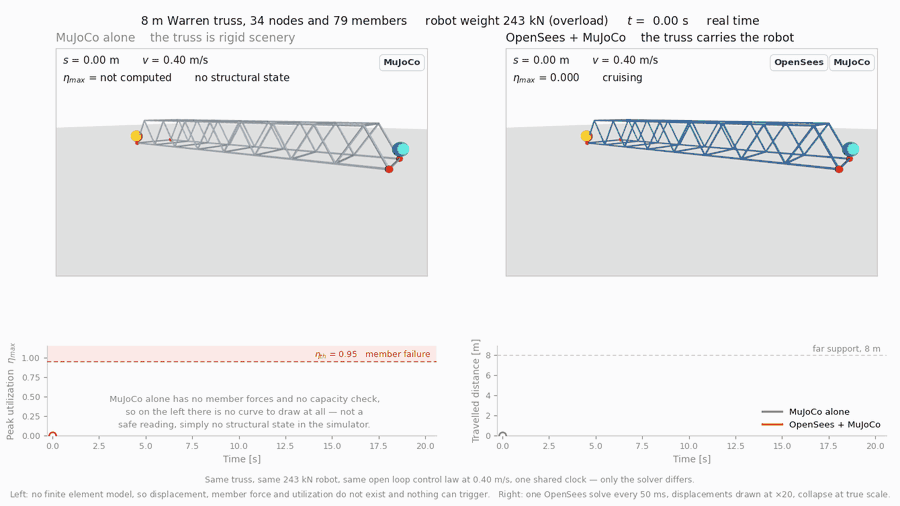
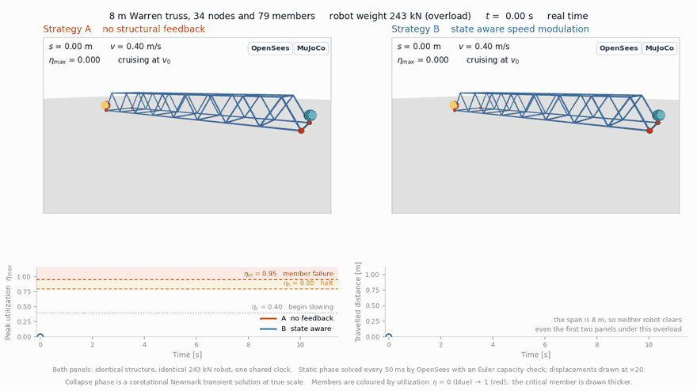
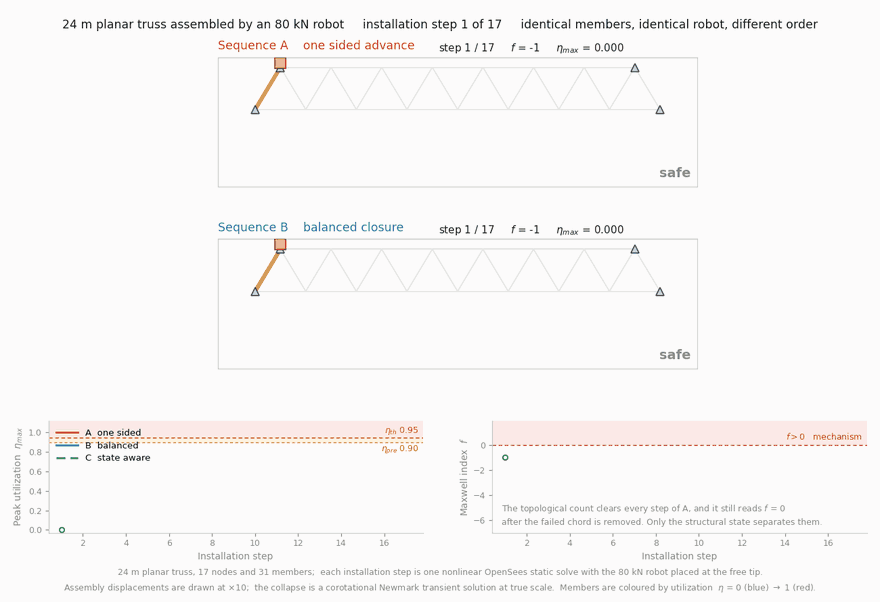
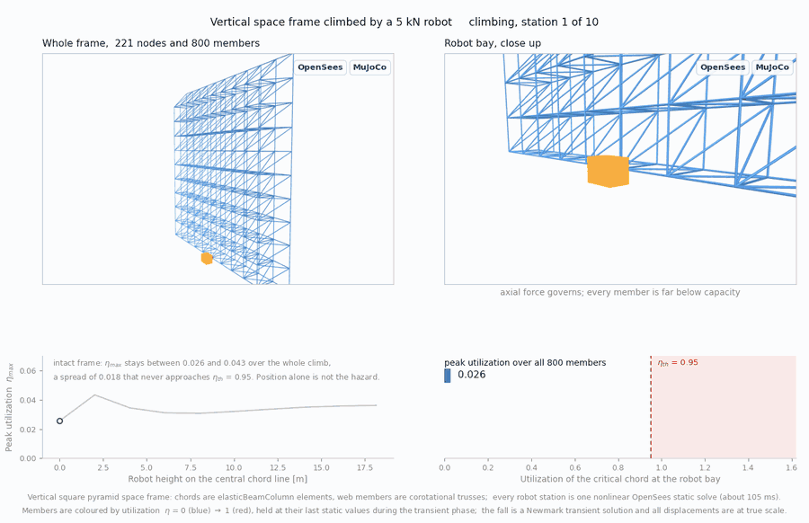

#  StructAware-RobotSim

### Structural state-aware simulation of construction robots via real-time finite element analysis

**OpenSees × MuJoCo** — two engines coupled, so the structure a robot works on is no longer rigid scenery.

---

A robot simulator normally treats the structure it stands on as rigid scenery. This one does not.
An OpenSees finite element model and a MuJoCo robot simulator run as two asynchronous engines
coupled through a shared-state buffer, so the robot's own weight deforms the structure, the
deformation is solved inside the control loop, and the resulting member utilization feeds straight
back into what the robot is allowed to do. When the structure can no longer carry the load, the
simulator switches from a static solve to a transient collapse analysis and keeps rendering.

> 📄 The accompanying paper is **under review**. 
> 🧠 **The source code is temporarily withheld during peer review** and will be opened in stages
> at this repository — see the [release roadmap](#-release-roadmap) below.

> 🔬 **Every frame below is a real solve.** No keyframes, no illustrations — each animation frame
> is one OpenSees solution.

---

## 🎬 What it does

### 1️⃣ Structural feedback changes the outcome

Same truss, same 243 kN robot, same open-loop control law at 0.40 m/s, one shared clock — **only
the physics engine differs**. With MuJoCo alone the structure is rigid scenery and the robot
strolls across in 20 s. With OpenSees in the loop, the same crossing overloads an end diagonal at
0.96 m and the panel collapses under the robot.

### 2️⃣ Feedback turns the same overload into a safe halt

Two robots, same 243 kN overload. The structure-unaware strategy walks into member failure and
progressive collapse; the structure-aware strategy senses utilization, slows inside the caution
band, and halts at 0.80 m with the peak utilization capped at its halt threshold — no member lost.

### 3️⃣ During construction, the governing member is far from the robot

An 80 kN installer erects a 24 m cantilever truss. Rigidity counting approves every step of the
one-sided sequence, yet the root chord — about 15 m from the installer — fails at step 13 and the
half-built structure collapses. The balanced sequence closes the span at a peak utilization of 0.66.

### 4️⃣ It scales to a built space frame and keeps solving through collapse

A 221-node, 800-member square-pyramid space frame from a real project. Severe local damage at the
robot bay yields the bending-governed chords, the static solver loses equilibrium, and the
simulator hands over to the transient engine: the robot panel free-falls 3 m in 0.81 s while the
rest of the frame re-equilibrates.

🌐 **Interactive pages**:
[English](https://lufengwong.github.io/StructAware-RobotSim/media/StructAware-RobotSim.html) ·
[中文](https://lufengwong.github.io/StructAware-RobotSim/media/StructAware-RobotSim-zh.html)

---

## 🔑 Headline numbers

| What | Result |
|---|---|
| Full analysis cycle at production scale (34 nodes / 79 members) | **3.77 ms** — under ¼ of a 60 fps frame |
| Transient collapse solver at the same scale | **17× faster than real time** |
| Synchronous-coupling limits (static / transient) | ≈ **190 / 480 nodes** — beyond them the asynchronous architecture takes over |
| Randomized overload traversal (n = 40 per strategy) | unaware **39/40 collapses** vs aware **0/40** |
| Sudden-member-loss benchmark vs guideline value 2.0 | mean DAF **2.004** across all 31 removable members |
| Largest model, one nonlinear solve | 221 nodes / 800 members, ≈ **110 ms** |

---

## 🗓 Release roadmap

The full stack will be opened here in stages, keeping this repository as the single permanent URL:

| Stage | Contents | Status |
|---|---|---|
| ✅ **Now** | Demo animations (GIF + MP4), interactive demonstration pages (EN / 中文) | released |
| 📊 **Upon acceptance** | Benchmark data behind every reported number (CSV/JSON), verification suite — coupling-integrity checks and the collapse credibility benchmark | 🔒 pending review |
| 🧠 **Upon publication** | Core dual-engine simulator (OpenSees × MuJoCo, shared-state buffer, mode switching), all four structural models, Monte Carlo experiment scripts, robot model, animation generators | 🔒 pending review |

*Until then, questions about the implementation are welcome via issues or email.*

---

## 📜 License & citation

Released materials are under the [MIT License](LICENSE). A citation entry will be added upon
publication of the paper.
